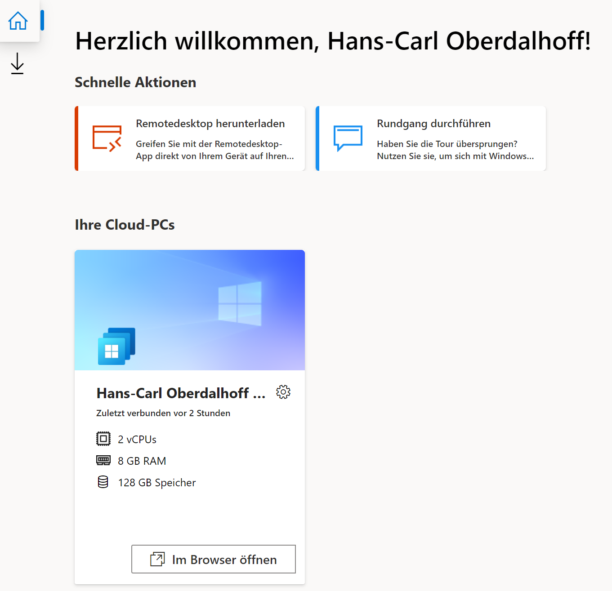

I had the opportunity to play around with Windows 365, Microsoft's new Cloud-based Desktop-as-a-Service (DaaS). To be more specific, we are testing out Windows 365 "Business". 

Windows 365 allows to deploy a virtual Windows VM per user on Azure, but will not force you to manage the VM or Azure resources yourself.

Basically, you just assign it like a license to a user and it will just appear for the user.

Windows 365 "Business" is different from its bigger "Enterprise" counterpart, as 
- You can not choose a custom OS image.
- You can not integrate existing on-prem networks (no VPN/VNet-Attach)
- You can not choose the location of your VMs (the Azure datacenter is chosen for you)
- You can have a max. of 300 VMs 

We actively chose this as it has a wonderful upside: There is no need for an Active Directory Domain Controller. The VMs will natively join you tenant's AzureAD and automatically be picked up by your Intune/Endpoint Manager (if you configured that accordingly). Nice.

Performance. Well. Kinda slow. Feels throttled under load. When at rest on used for normal office work it is responsive and fast even with a 2 vCPU setup.

No MEM Provisioning UI. Of course, you don't need it if you can choose images, VM locations etc. ;)

No (v)TPM, SecureBoot, Bitlocker is skipped implicitely. No changes needed. But this might harm the longevity of these VMs - Windows 11 does require a TPM and Secure Boot.

Be aware if you "trust" compliant devices - no biometry. I imagine some security-officers have interesting questions about VMs, that are not encrypted, not in the right country and might (in many cases) be implictely trusted ("compliant") in regards to Conditional Access.

No SSO (saved PWs possible) in the clients. 

The SSO thingy and the URLs of the "feed" etc. strongly remind me of WVD/AVD. There seems to be a lot of shared code base.

Ipad. Fantastic! But not on a monitor - strange resolution, letterboxing. Mouse has an actualy "Windows" Pointer, not the ipad "blob".

It is "RDP-like" remote session - how will it handle in place upgrades? Win11 Beta fails probably because of that. Applications that do not work over RDP will be a problem here to. (Which are not maaaany anymore luckily).

Everyone gets the same image - Currently OS is deploying with region set to "US" and language en-us although I am in Germany also as usage location and my user has de-de as language. At least the VM seems to be in the UK, not in the US.

Teams-redirection on a Windows client seems to work reasonably well. But if you can, use a native Teams-Client for calling :)