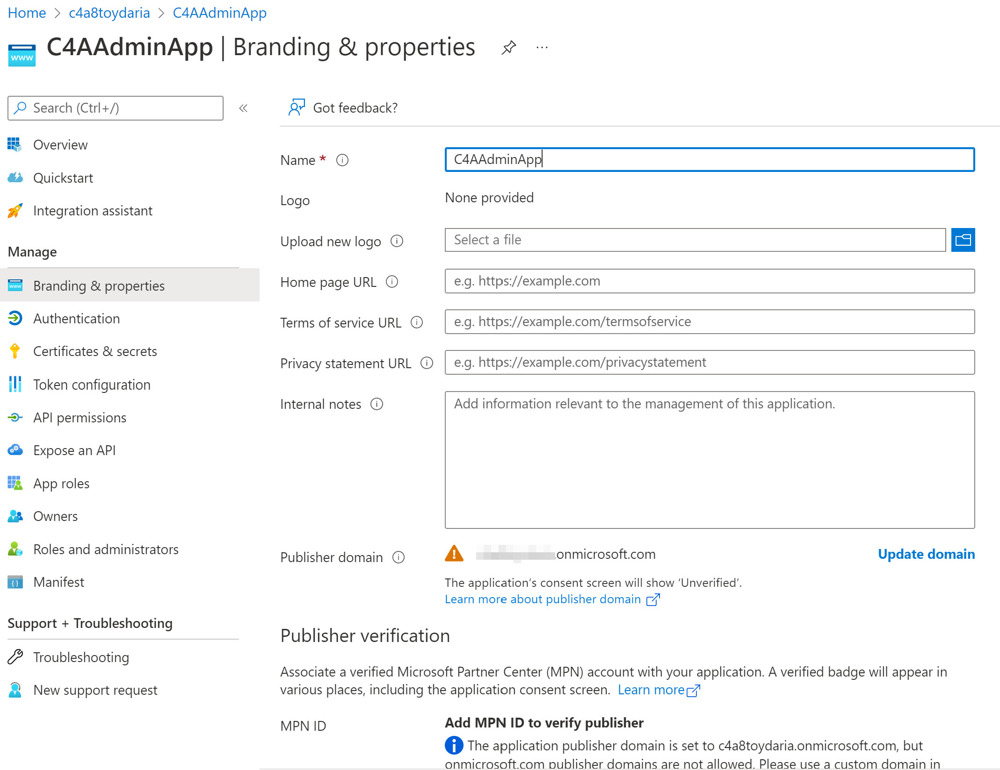
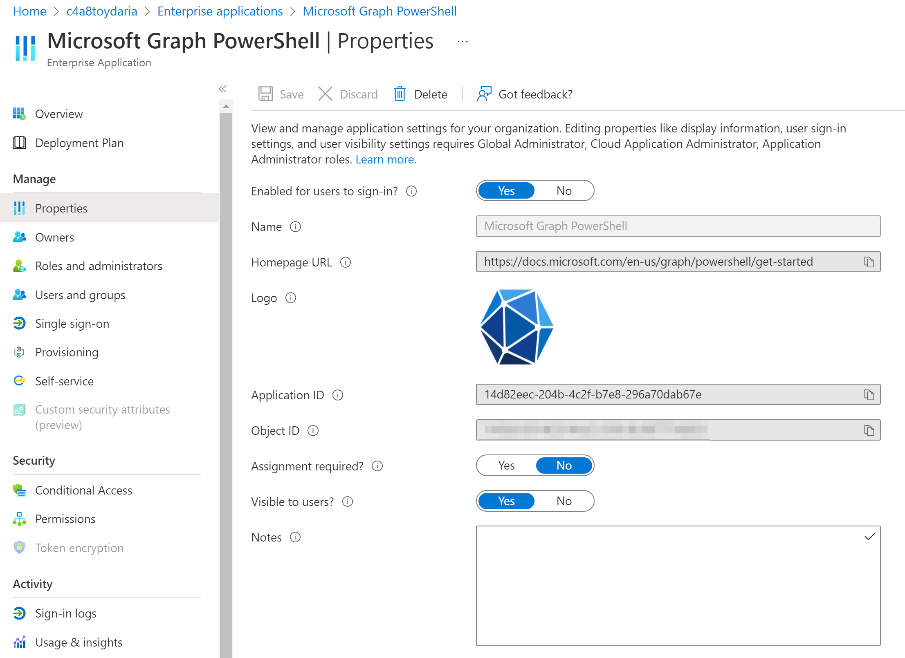
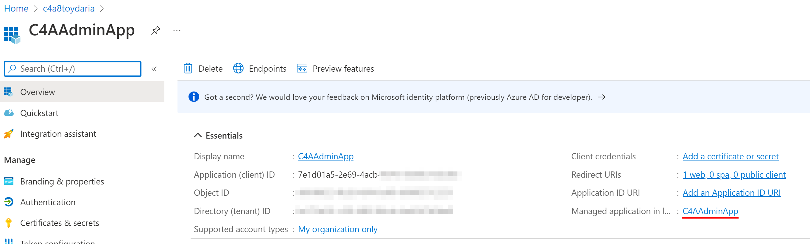
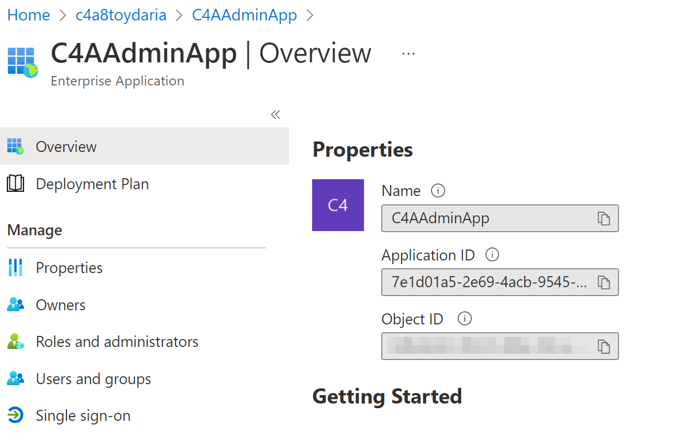

# Overview

Very often when discussing permissions for applications in AzureAD I encouter confusion about what an application registration is vs. an enterprise application.

Of course you can read a similiar (and more indepth article) from Microsoft [here](https://docs.microsoft.com/en-us/azure/active-directory/develop/app-objects-and-service-principals).

So what are two things? I'll talk about the confusion later.

## Application Registration 
An **Application registration** (AppReg) is another name for an "application object" in AzureAD. Basically (as the name implies) - you create a new (globally unique) application definition. 

You can kind of compare this to a template or manifest for your application. This template represents how your application will integrate into this AzureAD tenant and possibly any other tenant. Remember: This definition is GLOBALLY unique - for every AzureAD tenant. If you allow your App to be used in other AzureAD tenants this is called an "Multitenant App". If you only allow the App to be used in your own tenant then it is called a "Single Tenant App".

An AppReg defines aspects like:
- Authentication schemes your application supports
- Permissions that need to be granted for the application to work 
- Name, description, icon and other attributes of your application
- If usage in other tenants is possible

As this definition might change with your application's needs, Azure Portal offers you to interactively modify permissions etc. This is why admins very often rely on an application registration to integrate a third party app; but more on this later.

Another way to understand it is to thing of "publishing" your app to the world through an AppReg.

## Enterprise Application
An **Enterprise Application** (EntApp) is another name for a "service principal". A "service principal" is an anchor of an application in your AzureAD tenant. Specifically it can be a reference to an application registration.  

There are multiple kinds of EntApps. This text focusses on EntApps that allow you to use an application that is defined by an AppReg in your or another tenant. E.g. Managed Identities are also service principals (and can also be found in the EntApps shard in AzureAD Portal).

In contrast to an AppReg an EntApp is an actual identity. That means for example
- It can interact with data and services in your tenant
- You can authenticate against the app and use it.

As the application is defined by an AppReg you are not really supposed to change its metadata, permissions etc. Azure Portal thus does not offer interactive means to modify an EntApp other than deciding who owns it and who can use it.

## How do they work together?

When you create an App Registration, AzureAD automatically creates an Enterprise App to go along with it in your tenant. You can see a reference to the Enterprise App in the App Registration's properties.

Both objects share the same "Application ID" (specifically to identify which App Registration is your Enterprise App anchors).

And here is the coresponding Enterprise App which was created with the App Registration. Have a look at the Application ID.

## Permissions on App Registrations

Azure Portal makes it extremly simple to create and use an Application Registration to the point that it hides the moving parts. And this is very the 

## Other small problems

A little rant: As managed identities are also service principal and handled like enterprise apps there curre